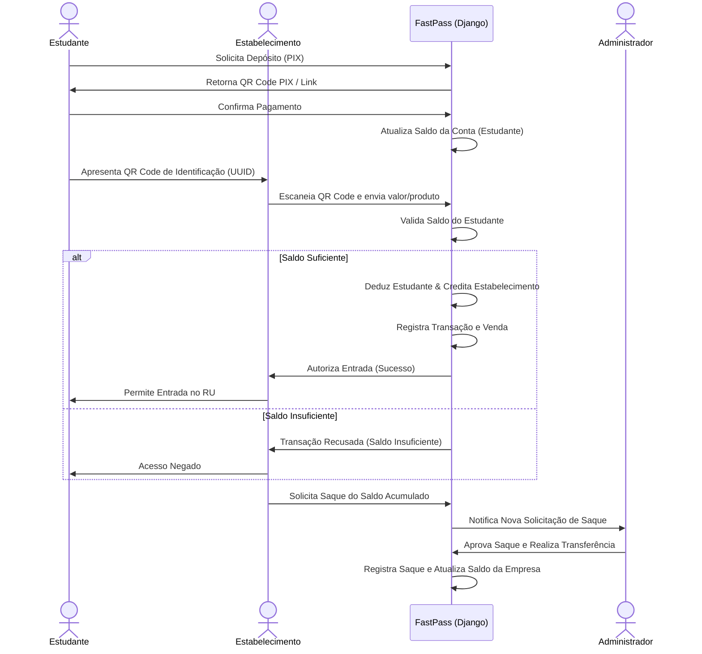

# FastPass - Resumo da Proposta do Projeto

Este documento apresenta o resumo da proposta do projeto **FastPass**, um sistema de gerenciamento de entradas e créditos para restaurantes universitários (RUs) e cantinas, baseado no modelo de proposta atualizado.

---

## 1. Identificação do Projeto

* **Nome do Projeto:** FastPass
* **Instituição:** Universidade Federal da Fronteira Sul (UFFS) - Campus Chapecó
* **Disciplina:** Tópicos Especiais em Programação (2026)
* **Discente:** Luiz Guilherme Zanella Lopes (Matrícula: 2211100006)
* **Docente:** Fabrício Herpich
* **Período de Realização:** 07/03/2023 a 06/07/2023

---

## 2. Visão Geral e Justificativa

O **FastPass** surge como uma alternativa de modernização ao atual sistema de fichas do Restaurante Universitário da UFFS. 

### O Problema Atual
1. **Fichas Físicas Frágeis:** Feitas em papel de fácil desgaste, pequenas e fáceis de perder pelo estudante.
2. **Lentidão e Filas:** A compra e a troca presencial de fichas físicas na entrada do restaurante geram grandes filas e atrasos nos horários de pico.
3. **Custo Operacional:** Necessidade constante de um funcionário dedicado exclusivamente para gerenciar as vendas e as trocas de fichas físicas em tempo real.

### A Solução FastPass
Uma plataforma web responsiva (Mobile First) que permite a portabilidade de um saldo virtual por meio de uma carteira digital segura. O aluno realiza recargas automáticas de crédito (via PIX) e apresenta um **QR Code** no smartphone para autenticar a entrada no RU, agilizando o fluxo de atendimento, reduzindo fraudes e eliminando o desperdício de papel.

---

## 3. Objetivos

### Objetivo Geral
Substituir o atual sistema de fichas físicas do Restaurante Universitário da UFFS, oferecendo uma forma moderna, rápida e digital de gerenciar entradas, agilizando o fluxo de estudantes e diminuindo custos operacionais.

### Objetivos Específicos
* **Digitalização:** Eliminar a necessidade de fichas físicas para entrada no RU.
* **Agilidade:** Diminuir o tempo de fila e aumentar a fluidez de entrada dos estudantes.
* **Praticidade de Pagamento:** Facilitar a compra de créditos pelo estudante utilizando transações digitais rápidas.
* **Segurança:** Mitigar riscos de roubos de dinheiro físico no caixa ou a circulação de fichas falsas.
* **Integração:** Desenvolver um sistema com boa arquitetura, preparado para integrar com catracas ou outras plataformas da UFFS.

---

## 4. Diagrama de Fluxo do Sistema

O diagrama abaixo ilustra a interação entre os principais atores e o sistema FastPass:

---

## 5. Requisitos do Sistema

### 5.1. Requisitos Funcionais (RF)

| Código | Descrição do Requisito |
| :--- | :--- |
| **RF01** | O sistema deve permitir o processo de autenticação completo e seguro, com cadastro de usuários, login e atribuição de permissões (autorização). |
| **RF02** | O sistema deve disponibilizar dois tipos principais de usuários finais (Estudantes e Estabelecimentos/RUs). |
| **RF03** | O sistema deve disponibilizar uma área de gestão de perfil para o usuário autenticado. |
| **RF04** | O sistema deve possibilitar uma forma de identificação única de cada usuário estudante para os estabelecimentos. |
| **RF05** | O sistema deve possibilitar formas de pagamento simples na plataforma: o estudante efetua o depósito, o dinheiro é creditado no saldo e as transações de débito atualizam os saldos em tempo real. |
| **RF06** | O sistema deve permitir solicitações de saques por parte dos estabelecimentos. |
| **RF07** | O sistema deve manter um registro consistente de transações (extrato financeiro). |
| **RF08** | O sistema deve fornecer interfaces minimalistas, limpas e fáceis de compreender, com apenas dados essenciais. |
| **RF09** | O usuário deve ser capaz de realizar o logout (deslogar) do sistema a qualquer momento. |
| **RF10** | O usuário do tipo Administrador deve ser capaz de analisar e aprovar/recusar solicitações de saques. |

### 5.2. Requisitos Não-Funcionais (RNF)

| Código | Descrição do Requisito |
| :--- | :--- |
| **RNF01** | **Consistência e Segurança:** O sistema deve garantir integridade dos dados, idempotência de pagamentos, criptografia de senhas/dados sensíveis e chaves primárias/únicas rigorosas para evitar fraudes ou duplicações. |
| **RNF02** | **Disponibilidade:** O sistema deve ser estável e estar disponível para acessos e transações a qualquer momento do dia (24/7). |
| **RNF03** | **Performance (Tempo de Resposta):** O carregamento de páginas comuns não deve passar de 6 segundos. Processamentos pesados/lentos devem ser assíncronos. |
| **RNF04** | **Responsividade:** A plataforma deve seguir o modelo "Mobile First", adaptando-se perfeitamente aos smartphones dos estudantes. |
| **RNF05** | **Escalabilidade:** Deve suportar um volume aceitável de acessos simultâneos (estimativa de ~10.000 usuários ativos da UFFS). |
| **RNF06** | **Usabilidade:** A interface deve ser focada na simplicidade e na acessibilidade para garantir uso intuitivo por todos os estudantes. |

---

## 6. Regras de Negócio (RN)

| Código | Regra de Negócio Detalhada |
| :--- | :--- |
| **RN01** | **Autenticação:** O cadastro de usuários exige *Nome/Razão Social*, *Email* e *Senha*. O login é feito exclusivamente via *Email* e *Senha*. |
| **RN02** | **Tipos de Usuários:** Os perfis permitidos são: **Estudante** (consome o serviço e transfere créditos), **Estabelecimento** (fornece o serviço, recebe créditos e solicita saques) e **Administrador** (gerencia o sistema e aprova saques). |
| **RN03** | **Operações de Saldo por Perfil:** Estudantes podem apenas realizar depósitos (creditar) para si mesmos. Estabelecimentos podem apenas realizar solicitações de saque (debito). |
| **RN04** | **Identificação por QR Code:** O identificador exclusivo do Estudante no sistema será seu `UUID`. Este UUID será gerado no backend e renderizado em tela no formato de QR Code ou código de barras para ser lido no terminal do RU. |
| **RN05** | **Processamento de Transações:** O pagamento de recarga do estudante será realizado via PIX (integrando com Stripe, Abacate Pay ou similar). O saldo correspondente fica disponível em carteira após confirmação da transação. |
| **RN06** | **Fluxo de Saque:** O estabelecimento deve: 1) Solicitar o saque do valor desejado; 2) Aguardar aprovação do administrador; 3) O administrador realiza o pagamento externo e altera o status do saque na plataforma para concluído. |
| **RN07** | **Estrutura do Extrato:** Cada transação deve registrar rigorosamente: `id` (identificador único), `tipo` (débito ou crédito), `valor`, `conta_remetente` (estudante) e `conta_destinatario` (estabelecimento/empresa). |
| **RN08** | **Layout da Dashboard:**  - **Comum:** Exibição de dados da conta (nome, e-mail) e histórico de transações filtrado. - **Estudante:** Exibe saldo atual, QR Code de identificação e botão de depósito. - **Estabelecimento:** Exibe saldo atual e botão para solicitação de saque. |
| **RN09** | **Fluxo de Logout:** A ação de logout deve limpar com segurança todos os tokens, cookies e sessões de usuário no navegador, redirecionando-o imediatamente para a tela de login. |
| **RN10** | **Moderação de Saques:** O administrador visualizará um painel administrativo com as solicitações de saques pendentes. Uma vez efetuado o pagamento (via banco tradicional/P2P), o status do saque é atualizado e o saldo é liquidado. |

---

## 7. Escopo, Entregas e Restrições

* **Escopo Técnico:** Plataforma Web Responsiva (mobile first), com Autenticação (Django Auth), controle de saldos por carteira, geração de QR Code dinâmico, integração com API de pagamentos (PIX) e painel de moderação de saques.
* **Fases do Ciclo de Vida:**
  1. *Fase 1: Iniciação* (Brainstorming e levantamento de requisitos).
  2. *Fase 2: Organização* (Modelagem do banco de dados relacional e lógica de negócio).
  3. *Fase 3: Execução* (Desenvolvimento do backend em Django e interfaces frontend responsivas).
  4. *Fase 4: Fechamento* (Testes unitários, deploy em produção e apresentação final).
* **Entregas Finais:** Código-fonte publicado no GitHub, sistema ativo em produção (Render ou Heroku), e slides explicativos.
* **Restrições:** Prazo definido pelo calendário acadêmico da disciplina e custo financeiro zero (uso exclusivo de recursos e hospedagem gratuitos).
